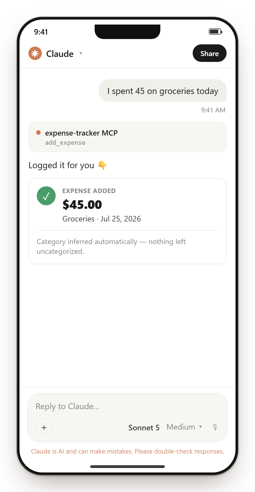
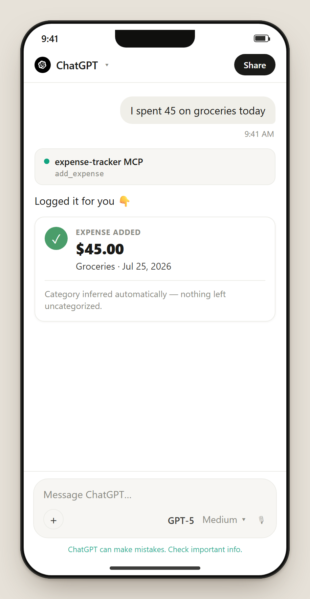
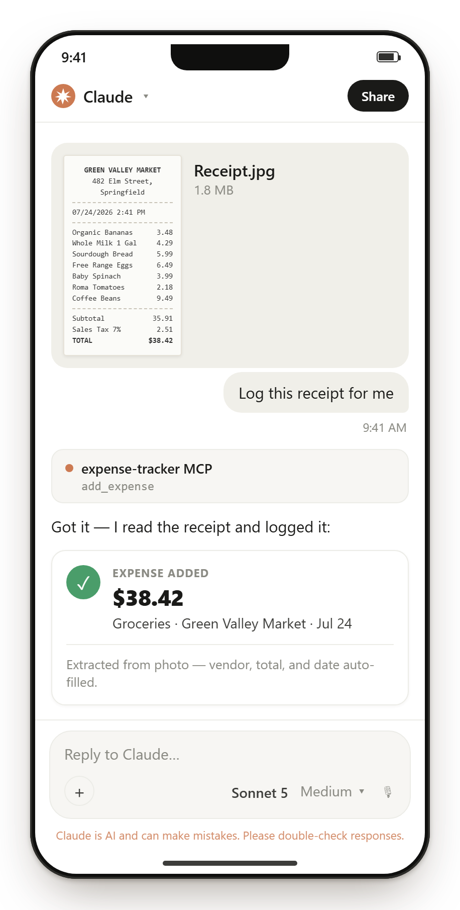
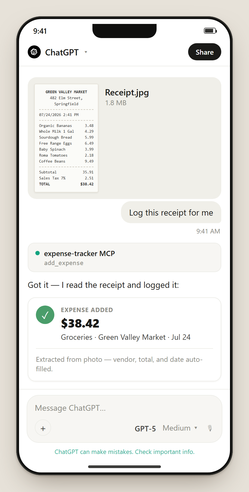
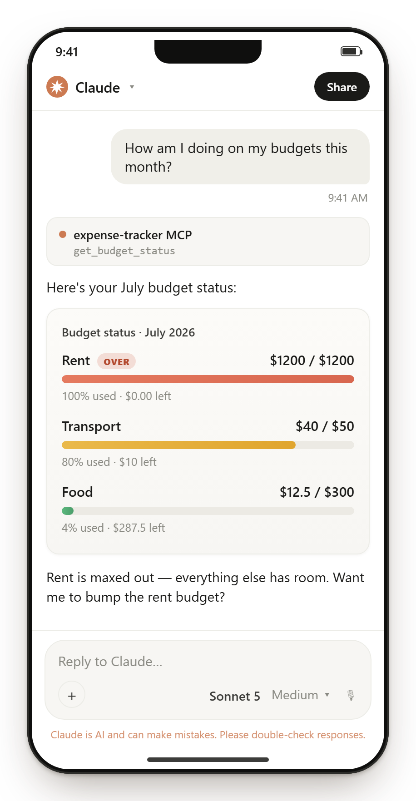
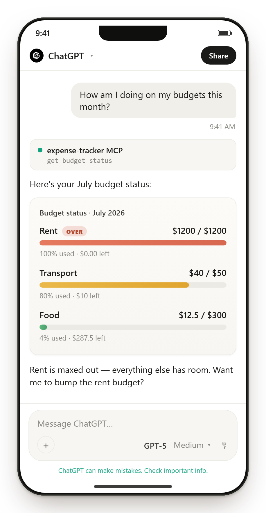
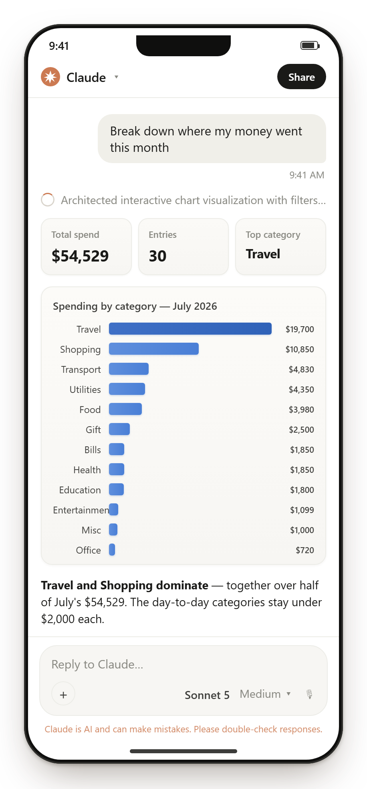
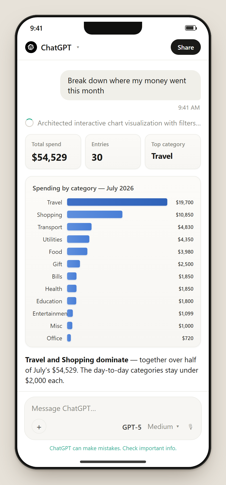
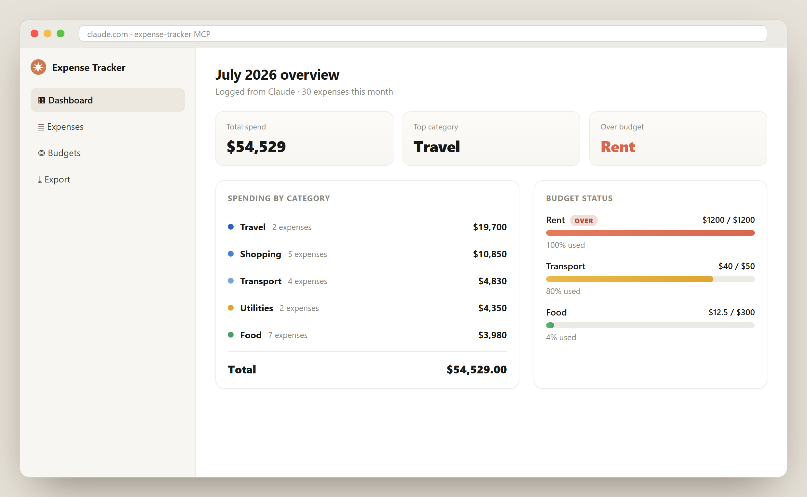
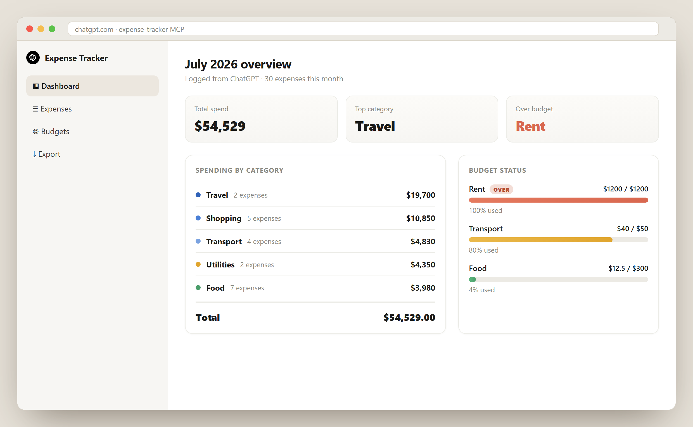

<p align="center">
  <picture>
    <source media="(prefers-color-scheme: dark)" srcset="./assets/logo/wordmark-dark.png">
    
  </picture>
</p>

# Money Copilot AI — MCP Server

A personal **expense tracker** [Model Context Protocol](https://modelcontextprotocol.io) server,
written in TypeScript and packaged for the [MCPize](https://mcpize.com) marketplace.

Record expenses, set monthly budgets, and generate spending summaries — from Claude,
Cursor, VS Code, or any MCP client. Each subscriber's data is isolated automatically.

### The same flows in Claude and ChatGPT

Log an expense in plain language, or drop in a receipt photo:

<p align="center">
  
  
  
  
</p>

Track budgets and get a spending report on demand:

<p align="center">
  
  
  
  
</p>

And a desktop dashboard view:

<p align="center">
  
  
</p>

> These mockups are generated from [`assets/marketing/marketing-kit.html`](./assets/marketing/marketing-kit.html)
> — open it with `?shot=<name>` (e.g. `?shot=claude-report`) to re-export any screen.

> Receipt photos are read by the host model's vision capability (Claude/ChatGPT) —
> the server itself only receives the already-extracted amount, category, vendor,
> and date via `add_expense`; it does not do OCR.

> 📘 **Continuing this project?** Read [KNOWLEDGE_BASE.md](./KNOWLEDGE_BASE.md)
> first — it's the deep reference for architecture, decisions, the storage/deploy
> incidents and their fixes, and open questions.

- **SDK:** official `@modelcontextprotocol/sdk` (v1.29+), schemas validated with `zod`
- **Transport:** dual — **stdio** for local dev / MCP Inspector, **Streamable HTTP** (stateless) for hosted deployment
- **Storage:** pluggable `ExpenseStore` interface — in-memory by default, or a durable libSQL/Turso-backed store (see "Storage & persistence" below; **required** for hosted use)
- **Money:** stored as integer minor units (no floating-point drift), ISO-4217 currency per record

---

## Tools

| Tool | Description |
| --- | --- |
| `add_expense` | Record an expense (`amount`, `category`, `description?`, `date?`, `currency?`) |
| `add_expenses` | Record many expenses in one call (batch — efficient for receipts / a day's spending) |
| `list_expenses` | List expenses, newest first, with category / date-range / free-text (`search`) filters |
| `get_expense` | Fetch one expense by id |
| `get_recent_expense` | Resolve "my last expense" / "that one" → the most recent expense (optionally by category) |
| `update_expense` | Update fields of an existing expense |
| `delete_expense` | Delete an expense by id |
| `summarize_expenses` | Totals grouped by `category` or `month`, over an optional range |
| `set_budget` | Set a monthly budget (per-category or overall) |
| `list_budgets` | List all budgets (overall + per-category) |
| `delete_budget` | Remove a budget (per-category or overall) |
| `get_budget_status` | Spend vs. budget for a month, with over-budget flags |
| `list_categories` | Categories used, with counts and totals |
| `full_budget_report` | Complete monthly expense/budget report with category pie and budget bar-chart images |
| `add_income` / `get_cash_flow_report` | Track income, net cash flow, and savings rate |
| `set_recurring_expense` | Manage recurring rent, subscriptions, utilities, and loan payments |
| `split_expense` / `import_expenses` | Split a purchase across categories or bulk-import CSV expenses |
| `get_spending_forecast` / `compare_months` | Forecast month-end spending and compare multi-month trends |
| `get_budget_alerts` / `set_alert_thresholds` | Configure 50/80/100-style budget alerts |
| `set_budget_email_alert` | Opt into an email when a monthly budget is crossed |
| `get_dashboard_link` | Create a 15-minute private link to the authenticated user's `/dashboard` page |
| `manage_categories` / `manage_budget_templates` | Set category limits and reusable budget templates |
| `find_duplicate_expenses` | Identify likely duplicate transactions |
| `export_expenses` | Export as CSV, JSON, or a portable PDF payload |

**Resources:** `expense://recent` (last 20), `expense://summary/current-month`
**Prompts:** `monthly_report`, `budget_review`

---

## Local development

Requires Node.js 18+ (20 recommended).

```bash
npm install
npm run build
```

### Run over stdio (for Claude Desktop, Cursor, or the MCP Inspector)

```bash
npm run start:stdio
```

Test interactively with the MCP Inspector:

```bash
npm run inspect
```

### Run over HTTP (Streamable HTTP, the transport MCPize uses)

```bash
npm run start:http
# -> POST http://localhost:8080/mcp   (GET /health or /ping for a health check)
```

Point an MCP client at `http://localhost:8080/mcp`.

### Private dashboard

`GET /dashboard` renders the authenticated user's own budgets, monthly spend,
income, categories, and recent expenses. It uses the same `x-mcpize-user-id`
identity as the MCP endpoint and never returns data without an identity.

For a browser opened outside MCPize's authenticated proxy, call
`get_dashboard_link`. Configure `PUBLIC_BASE_URL` and a strong
`DASHBOARD_SESSION_SECRET` (the same secret must be configured in the MCPize
deployment) to receive a signed link that expires after 15 minutes.

### Tests

The suite ([`vitest`](https://vitest.dev)) covers the utilities, the store, and
the full MCP tool/resource/prompt layer — the latter by connecting a real MCP
`Client` to `buildServer()` over the SDK's in-memory transport, so the actual
handlers run without HTTP.

```bash
npm test              # run once
npm run test:watch    # watch mode
npm run test:coverage # with a coverage report
```

### Configuration

Copy `.env.example` to `.env`. All variables are optional:

| Variable | Default | Purpose |
| --- | --- | --- |
| `MCP_TRANSPORT` | auto | `http` or `stdio`. If unset, HTTP when `PORT` is present, else stdio. |
| `PORT` | `8080` | HTTP port (set automatically by MCPize / Cloud Run). |
| `DEFAULT_CURRENCY` | `USD` | ISO-4217 code used when an expense omits a currency. |
| `TURSO_DATABASE_URL` | — | libSQL/Turso connection URL. If set, storage is durable (survives restarts). **Set this for any hosted deployment.** |
| `TURSO_AUTH_TOKEN` | — | Auth token, if not embedded in `TURSO_DATABASE_URL` as `?authToken=...`. |
| `DATA_DIR` | — | Fallback in-memory store's JSON persistence dir. Ignored if `TURSO_DATABASE_URL` is set. |
| `DEFAULT_USER_ID` | `local` (stdio) / `public` (http) | Fallback id for unauthenticated requests. |

---

## Per-subscriber isolation

In HTTP mode, every request is scoped to a user id derived from its auth header
(`x-mcpize-user` / `x-user-id`, or a hash of `Authorization` / `x-api-key`). MCPize
routes each subscriber's traffic with their own credential, so subscribers can never
see each other's expenses. In stdio mode there is a single local user.

---

## Storage & persistence

There are two `ExpenseStore` implementations. `src/index.ts` picks one
automatically: `TursoStore` if `TURSO_DATABASE_URL` is set, otherwise
`MemoryStore`.

- **`MemoryStore`** (`src/store/memory.ts`) — dependency-free, in-process. Data
  lives in RAM and optionally mirrors to a JSON file if `DATA_DIR` is set.
  Fine for local dev. **Do not rely on this for a hosted deployment** — see below.
- **`TursoStore`** (`src/store/turso.ts`) — a real SQLite/libSQL database, used
  whenever `TURSO_DATABASE_URL` is set. Survives restarts and is shared across
  concurrent instances, because the data lives outside the process.

### Why this matters: the scale-to-zero bug

If you test this server on MCPize's hosted playground with only `MemoryStore`
configured, you will hit this exact sequence:

1. `add_expense` a few times — the tool confirms each one correctly.
2. Wait a bit (reading the response, thinking of your next message).
3. Ask `"How much have I spent this month?"` — the server reports **zero
   expenses**, and may then re-add the same expenses from its own
   conversation memory, silently creating duplicates.

This is not a tool-calling bug — it's `MemoryStore`'s in-process RAM getting
wiped. MCPize's hosting (Cloud Run under the hood) **scales idle instances to
zero** to save cost — advertised explicitly in their FAQ. Every request can
also land on a different concurrent instance under load. Either way, a plain
in-memory `Map` does not survive it; a database does.

### Setting up durable storage (Turso)

1. Create a free database at [turso.tech](https://turso.tech) (sign up, then
   "Create Database" from the dashboard — pick a region close to your MCPize
   deploy region).
2. From the database's dashboard, copy the **connection URL**
   (`libsql://<db>-<org>.turso.io`) and create/copy an **auth token**.
3. Combine them into one value, since MCPize's free/hobby tier caps you at
   1 secret: `libsql://<db>-<org>.turso.io?authToken=<token>`
4. On **MCPize**, set that combined value as the `TURSO_DATABASE_URL` secret
   (declared in [`mcpize.yaml`](./mcpize.yaml)) via the dashboard. MCPize
   injects secrets straight into the process environment — nothing else needed.
5. Redeploy. `TursoStore.init()` creates its tables automatically on first run
   (`CREATE TABLE IF NOT EXISTS`) — no separate migration step.

**Running locally against a database.** The server reads `process.env`
directly — it does *not* auto-load `.env`. Either export the var in your shell,
or (Node ≥ 20.6) pass the file explicitly:

```bash
node --env-file=.env dist/index.js --http
```

For local dev without any network dependency, point `TURSO_DATABASE_URL` at a
local SQLite file — same code path, zero setup:
`TURSO_DATABASE_URL=file:./data/local.db`.

> **Troubleshooting — `UND_ERR_CONNECT_TIMEOUT` connecting to Turso locally.**
> On NAT64 / IPv6-transition networks (some ISPs and mobile networks), Node's
> default IPv4-first connect can't reach Turso's endpoint and times out after
> 10 s, even though the network is otherwise fine. Force IPv6 ordering:
> `NODE_OPTIONS=--dns-result-order=ipv6first`. This is a local-network quirk
> only — it does **not** affect the MCPize deployment.

If you'd rather use a different backend (Postgres, Upstash Redis, etc.),
implement `ExpenseStore` (`src/store/types.ts`) against it in a new file under
`src/store/` and construct it in `createStore()` in `src/index.ts` — the MCP
tool layer (`server.ts`) is storage-agnostic and needs no changes either way.

---

## Deploy to MCPize

Configuration lives in [`mcpize.yaml`](./mcpize.yaml) (`runtime: typescript`,
HTTP transport, `npm run build`). The server auto-detects HTTP mode from the
`PORT` that MCPize injects.

```bash
npm install -g mcpize
mcpize login
mcpize deploy
```

Then set the server's visibility to **public** in the MCPize dashboard to list it
on the marketplace. Pricing tiers are configured in the dashboard, not in
`mcpize.yaml`. See the [publishing guide](https://mcpize.com/developers/publish-mcp-server).

Before publishing: add an icon (512×512 PNG) and screenshots, and connect Stripe
if you plan to charge.

---

## Project layout

```
src/
  index.ts          # transport bootstrap (stdio | Streamable HTTP)
  server.ts         # buildServer(): registers tools, resources, prompts
  util.ts           # money / date / id helpers, per-user id resolution
  store/
    types.ts        # Expense, Budget, ExpenseStore interface
    memory.ts       # in-memory store with optional JSON persistence
tests/
  util.test.ts      # money / date / id helpers
  store.test.ts     # store CRUD, isolation, budgets, persistence
  server.test.ts    # tools/resources/prompts via in-memory MCP client
mcpize.yaml         # MCPize deployment config
vitest.config.ts    # test + coverage config
```

## License

This repository is provided for **reading and study purposes only** — see
[LICENSE](./LICENSE). Running, deploying, or commercial use of the Software
is not permitted under this license.

---

## Implementation notes (for whoever/whatever continues this project)

This section is a handoff document, not marketing copy. It records *why*
things are built the way they are, what's already been verified, and what's
still open — so a fresh AI coding agent (or a human) can pick this up without
re-deriving decisions or re-discovering bugs that were already found and fixed.

### Current state, precisely

- **Git**: single repo, `main` branch only, pushed to
  `https://github.com/TanvirIslam-BD/expense-tracker-mcp.git`. No open
  branches, no PRs, no CI configured. Run `git log --oneline` for the current
  commit list rather than trusting a count written here — it goes stale
  immediately.
- **Build**: `npm run build` compiles clean with `tsc` (strict mode, no `any`
  leaks). Verified working on Node v22.23.1 / npm 10.9.8 on Windows.
- **Tests**: 44 tests across 4 files, all passing, ~94% statement coverage
  (`npm run test:coverage`). `src/index.ts` and `src/store/types.ts` are
  excluded from coverage (process bootstrap and interfaces-only, respectively).
- **Dependency versions actually installed** (see `package-lock.json` for
  exact resolutions): `@modelcontextprotocol/sdk@1.29.0`, `zod@3.25.76`,
  `express@4.22.2`, `vitest@2.1.9`, `@libsql/client@0.14.0`. `package.json`
  version ranges are looser (`^1.12.0` etc.) — if you bump these, re-run the
  full test suite, since the SDK has changed method signatures between minor
  versions before.
- **Locally installed for real use**: registered in Claude Desktop's
  `claude_desktop_config.json` (stdio transport, `DATA_DIR` pointed at
  `D:/mcp_tracker_exp/data`) alongside a pre-existing `webcommander-local`
  server — do not overwrite that entry if editing the config again. A handful
  of real expenses exist in that local `data/expenses.json` from manual testing
  (food, transport) — it's git-ignored, so a fresh clone starts empty.
- **MCPize**: repo connected via the "GitHub Repository" deploy path on
  mcpize.com, auto-detected config from `mcpize.yaml` correctly (entry point,
  build/install commands, HTTP transport, Node 22 runtime). Deploy had not yet
  been confirmed completed as of this writing — check the MCPize dashboard for
  current status rather than assuming. CLI (`mcpize` npm package) is not
  installed locally; the GitHub-based deploy path was used instead, so the CLI
  workflow in "Deploy to MCPize" above is untested for this specific repo.
- **License tension, deliberately left unresolved**: [LICENSE](./LICENSE) is a
  read/study-only license (no running, no deployment, no commercial use), which
  literally contradicts hosting this on MCPize (which runs it) and having it
  registered in Claude Desktop (which also runs it). This was flagged
  explicitly to the project owner, who confirmed it's not a concern for now —
  **do not silently "fix" this** by changing the license; if it matters to a
  task you're doing, ask first.

### Architecture reasoning (why, not just what)

- **Dual transport in one `index.ts`** (`src/index.ts`): stdio for local
  dev/Claude Desktop/MCP Inspector, stateless Streamable HTTP for MCPize's
  Cloud Run hosting. Mode is auto-detected from `PORT` env presence unless
  forced via `--stdio`/`--http` or `MCP_TRANSPORT`. The HTTP path builds a
  **fresh `McpServer` per request** (`buildServer(store, userId)` in
  `src/server.ts`) rather than keeping one long-lived server — this is what
  "stateless" means here, and it's required because each request may belong to
  a different subscriber. The `ExpenseStore` instance is the one thing shared
  across requests (in-process singleton), which is how data persists between
  calls from the same subscriber.
- **Per-subscriber isolation** (`resolveUserId` in `src/util.ts`): derives a
  user id from `x-mcpize-user`/`x-user-id` headers if present, otherwise a
  SHA-256 hash (truncated) of the `Authorization`/`x-api-key` header, otherwise
  a fallback constant. This was chosen over requiring subscribers to pass an
  explicit user id, because MCPize's model is "one API key per subscriber" —
  the key itself *is* the identity. Isolation is verified at the store level in
  `tests/store.test.ts` (different `userId`s never see each other's data); the
  tool layer just passes `userId` through a closure from `resolveUserId`, so
  there's nothing tool-layer-specific left to test beyond that.
- **Money as integer minor units** (`toMinor`/`toMajor` in `src/util.ts`):
  avoids float drift on repeated addition (the classic `0.1 + 0.2` problem).
  All arithmetic in `src/server.ts` happens in minor units; conversion to
  major units happens only at the tool-result boundary (`view()` in `util.ts`).
- **Storage behind an interface** (`ExpenseStore` in `src/store/types.ts`):
  two implementations exist. `MemoryStore` (`src/store/memory.ts`) is
  dependency-free (no DB driver) so the project builds and tests anywhere with
  zero setup, optionally persisting to a single JSON file under `DATA_DIR`
  with writes serialized through a promise chain (`writeChain`) to avoid
  corrupting the file under concurrent mutation — but it **does not survive a
  process restart**, which is fatal on serverless hosting (see the bug entry
  below). `TursoStore` (`src/store/turso.ts`) is the production answer: a real
  SQLite/libSQL database, selected automatically in `src/index.ts` whenever
  `TURSO_DATABASE_URL` is set. It's built against `@libsql/client`, which
  speaks the same protocol whether pointed at a local file (`file:./x.db`,
  used in tests — zero network calls) or a remote Turso database — so the
  exact same code and tests exercise both. If you need a different backend
  (Postgres, Redis, etc.), implement `ExpenseStore` in a new file under
  `src/store/` and wire it into `createStore()` in `src/index.ts` — the tool
  layer (`server.ts`) needs zero changes either way; that's the point of the
  interface boundary.

### Bugs found and fixed (don't reintroduce these)

The first two were caught by tests that initially failed, confirmed as real
bugs (not bad test expectations), and fixed in source. The third was caught
live on MCPize's hosted playground, not by a test — see the note after it.

1. **`isValidDate` accepted impossible calendar dates.** `Date.parse` silently
   rolls `"2026-02-30"` into March 2 instead of rejecting it. Fixed in
   `src/util.ts` by round-tripping through `toISOString().slice(0,10)` and
   requiring it to equal the input string exactly.
2. **Non-deterministic same-day expense ordering.** `listExpenses` in
   `src/store/memory.ts` sorted by `date` then `createdAt`, but two expenses
   added in the same millisecond would tie and the sort became unstable
   (insertion order leaked through inconsistently). Fixed by adding an
   explicit insertion-index tiebreaker so "newest first" is deterministic even
   under same-millisecond writes.
3. **`MemoryStore` data vanished between messages on the hosted playground.**
   Reported symptom: after successfully adding several expenses, asking "how
   much have I spent this month?" a message or two later got back "no
   expenses recorded" — and the model then re-added the same expenses from its
   own conversation memory, silently duplicating them on every subsequent
   occurrence. Root cause: MCPize's hosting scales idle instances to zero
   (confirmed in their FAQ) and can route concurrent requests to more than one
   instance; `MemoryStore` is a plain in-process object, so any instance
   recycle or multi-instance routing wipes/fragments it. This is not a race
   condition or a flaky edge case — it is guaranteed to happen after any idle
   gap long enough for scale-to-zero to trigger. Fixed by adding `TursoStore`
   (real database, outside the process) and making it the one that gets used
   whenever `TURSO_DATABASE_URL` is configured. `MemoryStore` itself is
   unchanged and still correct for what it's for — local dev — the bug was
   using it in a context (hosted, multi-instance) it was never meant for.

If you touch date validation or expense ordering again, re-run
`tests/util.test.ts` and `tests/store.test.ts` specifically — they pin down
both of the first two with explicit cases (`"2026-02-30"` and the
four-expense same-date ordering test). For storage/restart behavior, see
`tests/turso-store.test.ts`'s "persistence across restarts" case, which
opens a fresh `TursoStore` against the same file to simulate exactly what a
Cloud Run instance recycle does.

### Testing approach — why an in-memory MCP client, not mocks

`tests/server.test.ts` doesn't mock the SDK or the tool handlers — it spins up
a real `McpServer` (via `buildServer`) and a real `Client`, connected through
`InMemoryTransport.createLinkedPair()` from the SDK itself
(`@modelcontextprotocol/sdk/inMemory.js`). This means the tests exercise the
actual JSON-RPC request/response path, schema validation, and tool dispatch —
not a hand-rolled approximation of it. If you add a tool, the pattern to copy
is already in that file: call `client.callTool({name, arguments})`, and use the
`jsonOf()`/`textOf()` helpers to pull structured data back out of the
```json fenced block every tool response includes.

### Marketplace asset generation — HTML mockups → Chrome headless

The screenshots in `assets/marketing/` were **not** captured from a live app —
there is no web UI in this project, since MCP tool calls render however the
host client (Claude, ChatGPT, etc.) chooses to display them. They are
hand-authored HTML mockups of what those clients' UIs look like, kept in a
single self-contained source of truth, `assets/marketing/marketing-kit.html`.
That file renders a gallery of all shots by default, or a single bare shot when
loaded with `?shot=<name>` (e.g. `?shot=claude-report`) — see the `shots` array
in its script for the full list of ids.

To (re)generate the PNGs, drive the HTML with headless Chrome — no npm
dependency, just the Chrome already on the machine:

```bash
chrome --headless=new --disable-gpu --hide-scrollbars \
  --force-device-scale-factor=2 --default-background-color=00000000 \
  --screenshot="claude-report.png" --window-size=458,982 \
  "file:///…/assets/marketing/marketing-kit.html?shot=claude-report"
```

`--force-device-scale-factor=2` gives crisp 2× output; the transparent
background keeps the phone frame's rounded corners clean for embedding.
Per-shot `--window-size` values are sized to each mockup's bounds (mobile ≈
458×882–982, desktop ≈ 1240×764). Chrome may refuse to write into the repo dir
— render into a scratch dir and copy the PNGs into `assets/marketing/`.

The receipt-photo mockups are careful to depict the **host model** doing
OCR/extraction and calling `add_expense` with already-structured fields — the
server itself has no image or OCR capability, and the mockups must not
misrepresent that.

### Open items / natural next steps

Roughly in likely order of relevance, not commitment:

- **Confirm the MCPize deploy actually succeeded** and hits `/health`; the
  dashboard is the source of truth, not this document.
- **Set `TURSO_DATABASE_URL` on the actual MCPize deployment** — implementing
  and testing `TursoStore` locally (done, see bug #3 above) is not the same as
  it being configured on the live hosted instance. Until that secret is set on
  MCPize, the hosted server is still running on `MemoryStore` and will still
  lose data on scale-to-zero.
- **CI** — no GitHub Actions workflow exists yet; `npm ci && npm run build &&
  npm test` on push/PR would catch regressions before they reach main.
- **x402 pay-per-call pricing** or subscription tiers — mentioned as a
  possibility earlier in the project's discussion but not started.
- **Stripe connection** — only needed if/when charging subscribers via
  MCPize's subscription model.
- **License decision** — revisit only if explicitly asked; see above.
