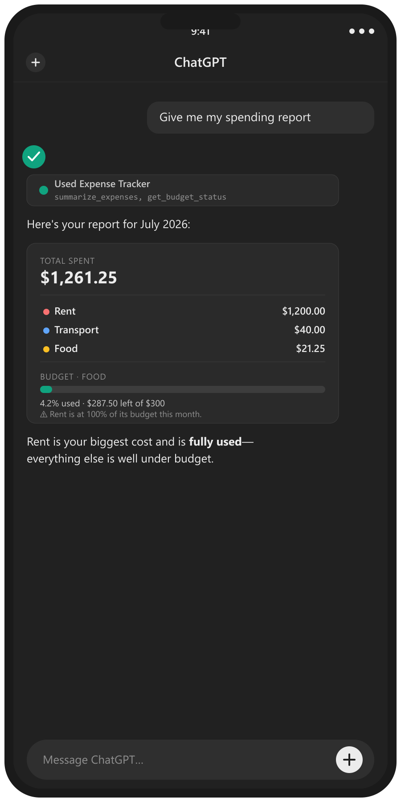
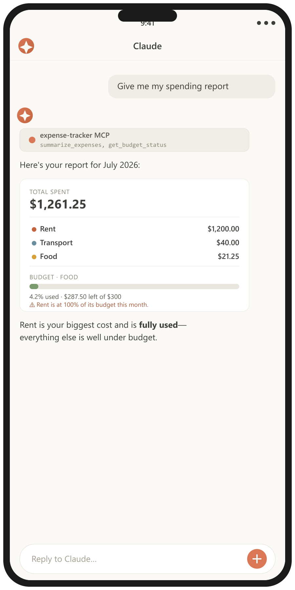
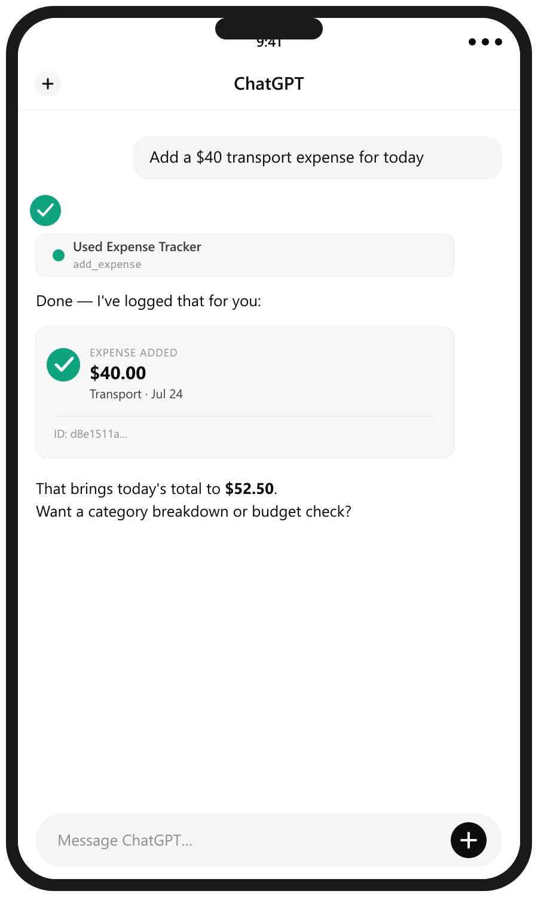
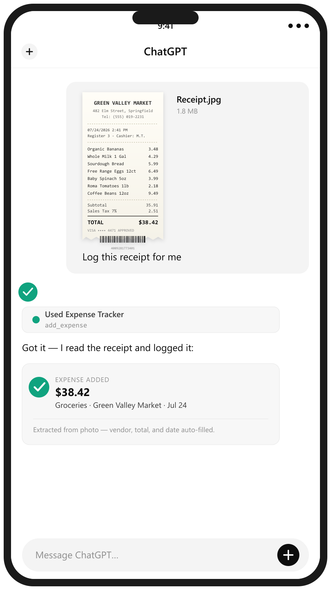
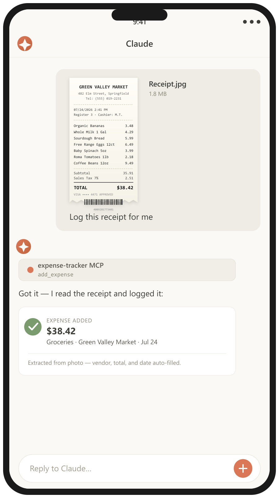
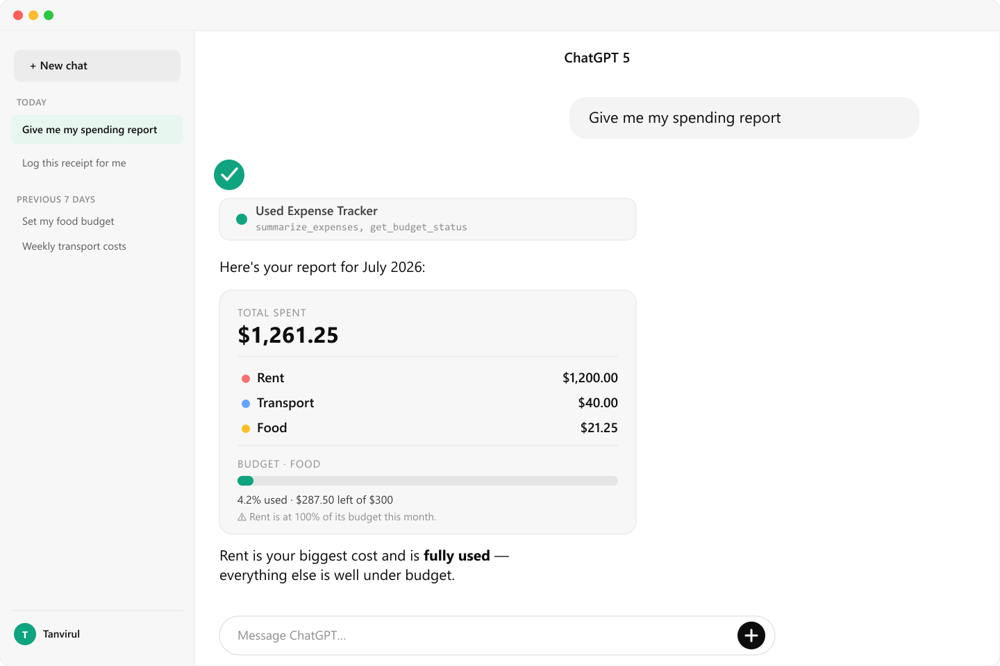
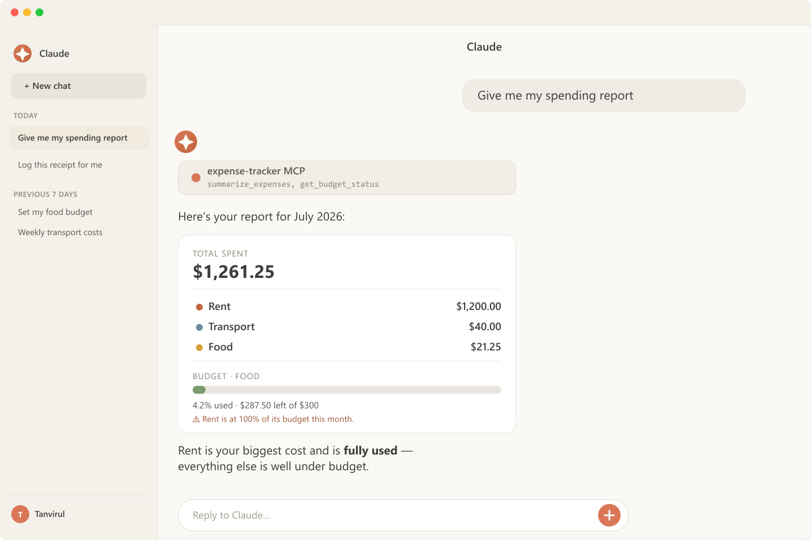

# Expense Tracker MCP Server

A personal **expense tracker** [Model Context Protocol](https://modelcontextprotocol.io) server,
written in TypeScript and packaged for the [MCPize](https://mcpize.com) marketplace.

Record expenses, set monthly budgets, and generate spending summaries — from Claude,
Cursor, VS Code, or any MCP client. Each subscriber's data is isolated automatically.

<p align="center">
  
  
  
  
  
</p>
<p align="center">
  
  
</p>

> Receipt photos are read by the host model's vision capability (Claude/ChatGPT) —
> the server itself only receives the already-extracted amount, category, vendor,
> and date via `add_expense`; it does not do OCR.

- **SDK:** official `@modelcontextprotocol/sdk` (v1.29+), schemas validated with `zod`
- **Transport:** dual — **stdio** for local dev / MCP Inspector, **Streamable HTTP** (stateless) for hosted deployment
- **Storage:** pluggable `ExpenseStore` interface; ships with a dependency-free in-memory store (optional JSON persistence)
- **Money:** stored as integer minor units (no floating-point drift), ISO-4217 currency per record

---

## Tools

| Tool | Description |
| --- | --- |
| `add_expense` | Record an expense (`amount`, `category`, `description?`, `date?`, `currency?`) |
| `list_expenses` | List expenses, newest first, with category / date-range filters |
| `get_expense` | Fetch one expense by id |
| `update_expense` | Update fields of an existing expense |
| `delete_expense` | Delete an expense by id |
| `summarize_expenses` | Totals grouped by `category` or `month`, over an optional range |
| `set_budget` | Set a monthly budget (per-category or overall) |
| `get_budget_status` | Spend vs. budget for a month, with over-budget flags |
| `list_categories` | Categories used, with counts and totals |
| `export_expenses` | Export as CSV or JSON |

**Resources:** `expense://recent` (last 20), `expense://summary/current-month`
**Prompts:** `monthly_report`, `budget_review`

---

## Local development

Requires Node.js 18+ (20 recommended).

```bash
npm install
npm run build
```

### Run over stdio (for Claude Desktop, Cursor, or the MCP Inspector)

```bash
npm run start:stdio
```

Test interactively with the MCP Inspector:

```bash
npm run inspect
```

### Run over HTTP (Streamable HTTP, the transport MCPize uses)

```bash
npm run start:http
# -> POST http://localhost:8080/mcp   (GET /health for a health check)
```

Point an MCP client at `http://localhost:8080/mcp`.

### Tests

The suite ([`vitest`](https://vitest.dev)) covers the utilities, the store, and
the full MCP tool/resource/prompt layer — the latter by connecting a real MCP
`Client` to `buildServer()` over the SDK's in-memory transport, so the actual
handlers run without HTTP.

```bash
npm test              # run once
npm run test:watch    # watch mode
npm run test:coverage # with a coverage report
```

### Configuration

Copy `.env.example` to `.env`. All variables are optional:

| Variable | Default | Purpose |
| --- | --- | --- |
| `MCP_TRANSPORT` | auto | `http` or `stdio`. If unset, HTTP when `PORT` is present, else stdio. |
| `PORT` | `8080` | HTTP port (set automatically by MCPize / Cloud Run). |
| `DEFAULT_CURRENCY` | `USD` | ISO-4217 code used when an expense omits a currency. |
| `DATA_DIR` | — | If set, expenses persist to `DATA_DIR/expenses.json`. Otherwise in-memory. |
| `DEFAULT_USER_ID` | `local` (stdio) / `public` (http) | Fallback id for unauthenticated requests. |

---

## Per-subscriber isolation

In HTTP mode, every request is scoped to a user id derived from its auth header
(`x-mcpize-user` / `x-user-id`, or a hash of `Authorization` / `x-api-key`). MCPize
routes each subscriber's traffic with their own credential, so subscribers can never
see each other's expenses. In stdio mode there is a single local user.

---

## Storage & persistence

The default `MemoryStore` is dependency-free and builds anywhere. With `DATA_DIR`
set it persists to a JSON file; otherwise data lives in memory.

> **Production note:** MCPize hosts servers on Cloud Run, whose filesystem is
> ephemeral and per-instance. For durable, multi-instance storage, implement the
> `ExpenseStore` interface (`src/store/types.ts`) against a real database
> (Postgres, Turso, etc.) and construct it in `src/index.ts` instead of
> `MemoryStore`. The MCP tool layer is storage-agnostic and needs no changes —
> add the connection string as a publisher secret (`DATABASE_URL`) in `mcpize.yaml`.

---

## Deploy to MCPize

Configuration lives in [`mcpize.yaml`](./mcpize.yaml) (`runtime: typescript`,
HTTP transport, `npm run build`). The server auto-detects HTTP mode from the
`PORT` that MCPize injects.

```bash
npm install -g mcpize
mcpize login
mcpize deploy
```

Then set the server's visibility to **public** in the MCPize dashboard to list it
on the marketplace. Pricing tiers are configured in the dashboard, not in
`mcpize.yaml`. See the [publishing guide](https://mcpize.com/developers/publish-mcp-server).

Before publishing: add an icon (512×512 PNG) and screenshots, and connect Stripe
if you plan to charge.

---

## Project layout

```
src/
  index.ts          # transport bootstrap (stdio | Streamable HTTP)
  server.ts         # buildServer(): registers tools, resources, prompts
  util.ts           # money / date / id helpers, per-user id resolution
  store/
    types.ts        # Expense, Budget, ExpenseStore interface
    memory.ts       # in-memory store with optional JSON persistence
tests/
  util.test.ts      # money / date / id helpers
  store.test.ts     # store CRUD, isolation, budgets, persistence
  server.test.ts    # tools/resources/prompts via in-memory MCP client
mcpize.yaml         # MCPize deployment config
vitest.config.ts    # test + coverage config
```

## License

This repository is provided for **reading and study purposes only** — see
[LICENSE](./LICENSE). Running, deploying, or commercial use of the Software
is not permitted under this license.

---

## Implementation notes (for whoever/whatever continues this project)

This section is a handoff document, not marketing copy. It records *why*
things are built the way they are, what's already been verified, and what's
still open — so a fresh AI coding agent (or a human) can pick this up without
re-deriving decisions or re-discovering bugs that were already found and fixed.

### Current state, precisely

- **Git**: single repo, `main` branch only, pushed to
  `https://github.com/TanvirIslam-BD/expense-tracker-mcp.git`. 4 commits:
  initial implementation → license → marketplace assets → one extra screenshot.
  No open branches, no PRs, no CI configured.
- **Build**: `npm run build` compiles clean with `tsc` (strict mode, no `any`
  leaks). Verified working on Node v22.23.1 / npm 10.9.8 on Windows.
- **Tests**: 33 tests across 3 files, all passing, ~93% statement coverage
  (`npm run test:coverage`). `src/index.ts` and `src/store/types.ts` are
  excluded from coverage (process bootstrap and interfaces-only, respectively).
- **Dependency versions actually installed** (see `package-lock.json` for
  exact resolutions): `@modelcontextprotocol/sdk@1.29.0`, `zod@3.25.76`,
  `express@4.22.2`, `vitest@2.1.9`. `package.json` version ranges are looser
  (`^1.12.0` etc.) — if you bump these, re-run the full test suite, since the
  SDK has changed method signatures between minor versions before.
- **Locally installed for real use**: registered in Claude Desktop's
  `claude_desktop_config.json` (stdio transport, `DATA_DIR` pointed at
  `D:/mcp_tracker_exp/data`) alongside a pre-existing `webcommander-local`
  server — do not overwrite that entry if editing the config again. A handful
  of real expenses exist in that local `data/expenses.json` from manual testing
  (food, transport) — it's git-ignored, so a fresh clone starts empty.
- **MCPize**: repo connected via the "GitHub Repository" deploy path on
  mcpize.com, auto-detected config from `mcpize.yaml` correctly (entry point,
  build/install commands, HTTP transport, Node 22 runtime). Deploy had not yet
  been confirmed completed as of this writing — check the MCPize dashboard for
  current status rather than assuming. CLI (`mcpize` npm package) is not
  installed locally; the GitHub-based deploy path was used instead, so the CLI
  workflow in "Deploy to MCPize" above is untested for this specific repo.
- **License tension, deliberately left unresolved**: [LICENSE](./LICENSE) is a
  read/study-only license (no running, no deployment, no commercial use), which
  literally contradicts hosting this on MCPize (which runs it) and having it
  registered in Claude Desktop (which also runs it). This was flagged
  explicitly to the project owner, who confirmed it's not a concern for now —
  **do not silently "fix" this** by changing the license; if it matters to a
  task you're doing, ask first.

### Architecture reasoning (why, not just what)

- **Dual transport in one `index.ts`** (`src/index.ts`): stdio for local
  dev/Claude Desktop/MCP Inspector, stateless Streamable HTTP for MCPize's
  Cloud Run hosting. Mode is auto-detected from `PORT` env presence unless
  forced via `--stdio`/`--http` or `MCP_TRANSPORT`. The HTTP path builds a
  **fresh `McpServer` per request** (`buildServer(store, userId)` in
  `src/server.ts`) rather than keeping one long-lived server — this is what
  "stateless" means here, and it's required because each request may belong to
  a different subscriber. The `ExpenseStore` instance is the one thing shared
  across requests (in-process singleton), which is how data persists between
  calls from the same subscriber.
- **Per-subscriber isolation** (`resolveUserId` in `src/util.ts`): derives a
  user id from `x-mcpize-user`/`x-user-id` headers if present, otherwise a
  SHA-256 hash (truncated) of the `Authorization`/`x-api-key` header, otherwise
  a fallback constant. This was chosen over requiring subscribers to pass an
  explicit user id, because MCPize's model is "one API key per subscriber" —
  the key itself *is* the identity. Isolation is verified at the store level in
  `tests/store.test.ts` (different `userId`s never see each other's data); the
  tool layer just passes `userId` through a closure from `resolveUserId`, so
  there's nothing tool-layer-specific left to test beyond that.
- **Money as integer minor units** (`toMinor`/`toMajor` in `src/util.ts`):
  avoids float drift on repeated addition (the classic `0.1 + 0.2` problem).
  All arithmetic in `src/server.ts` happens in minor units; conversion to
  major units happens only at the tool-result boundary (`view()` in `util.ts`).
- **Storage behind an interface** (`ExpenseStore` in `src/store/types.ts`):
  the only implementation today is `MemoryStore` (`src/store/memory.ts`), which
  is deliberately dependency-free (no DB driver) so the project builds and
  tests anywhere with zero setup. It optionally persists to a single JSON file
  under `DATA_DIR` with writes serialized through a promise chain
  (`writeChain` in `memory.ts`) to avoid corrupting the file under concurrent
  mutation. **This will not survive Cloud Run's ephemeral, per-instance
  filesystem in production** — see the "Storage & persistence" section above.
  If you're asked to add real persistence, implement `ExpenseStore` against
  Postgres/Turso/etc. in a new file under `src/store/`, wire it up in
  `src/index.ts`, and the tool layer (`server.ts`) needs zero changes — that's
  the point of the interface boundary.

### Bugs found and fixed while writing the test suite (don't reintroduce these)

Both were caught by tests that initially failed, then confirmed as real bugs
(not bad test expectations) and fixed in source:

1. **`isValidDate` accepted impossible calendar dates.** `Date.parse` silently
   rolls `"2026-02-30"` into March 2 instead of rejecting it. Fixed in
   `src/util.ts` by round-tripping through `toISOString().slice(0,10)` and
   requiring it to equal the input string exactly.
2. **Non-deterministic same-day expense ordering.** `listExpenses` in
   `src/store/memory.ts` sorted by `date` then `createdAt`, but two expenses
   added in the same millisecond would tie and the sort became unstable
   (insertion order leaked through inconsistently). Fixed by adding an
   explicit insertion-index tiebreaker so "newest first" is deterministic even
   under same-millisecond writes.

If you touch date validation or expense ordering again, re-run
`tests/util.test.ts` and `tests/store.test.ts` specifically — they pin down
both of these with explicit cases (`"2026-02-30"` and the four-expense
same-date ordering test).

### Testing approach — why an in-memory MCP client, not mocks

`tests/server.test.ts` doesn't mock the SDK or the tool handlers — it spins up
a real `McpServer` (via `buildServer`) and a real `Client`, connected through
`InMemoryTransport.createLinkedPair()` from the SDK itself
(`@modelcontextprotocol/sdk/inMemory.js`). This means the tests exercise the
actual JSON-RPC request/response path, schema validation, and tool dispatch —
not a hand-rolled approximation of it. If you add a tool, the pattern to copy
is already in that file: call `client.callTool({name, arguments})`, and use the
`jsonOf()`/`textOf()` helpers to pull structured data back out of the
```json fenced block every tool response includes.

### Marketplace asset generation — no browser needed, reproduce this way

The icon and screenshots in `assets/` were **not** captured from a live app —
there is no web UI in this project, since MCP tool calls render however the
host client (Claude, ChatGPT, etc.) chooses to display them. They were built
as hand-authored SVG mockups of what those clients' UIs look like, then
rasterized to exact-pixel PNGs with the `sharp` npm package (which ships
prebuilt binaries, so it installs cleanly on Windows without ImageMagick/
Inkscape/cairo). This was a deliberate fallback after an attempt to screenshot
rendered HTML via a browser preview tool produced viewport/scaling
inconsistencies (reported dimensions didn't match the captured pixels) — SVG →
`sharp` was simpler and pixel-exact. If more screenshots are needed later,
reuse that pattern: author an SVG at the target resolution, rasterize with a
throwaway `sharp` install in a scratch directory, copy the PNG into `assets/`,
delete the scratch `node_modules`. The receipt-photo mockups are careful to
depict the **host model** doing OCR/extraction and calling `add_expense` with
already-structured fields — the server itself has no image or OCR capability,
and the mockups must not misrepresent that.

### Open items / natural next steps

Roughly in likely order of relevance, not commitment:

- **Confirm the MCPize deploy actually succeeded** and hits `/health`; the
  dashboard is the source of truth, not this document.
- **Durable storage** — implement a Postgres/Turso-backed `ExpenseStore` for
  production use on Cloud Run (see "Storage & persistence" above).
- **CI** — no GitHub Actions workflow exists yet; `npm ci && npm run build &&
  npm test` on push/PR would catch regressions before they reach main.
- **x402 pay-per-call pricing** or subscription tiers — mentioned as a
  possibility earlier in the project's discussion but not started.
- **Stripe connection** — only needed if/when charging subscribers via
  MCPize's subscription model.
- **License decision** — revisit only if explicitly asked; see above.
